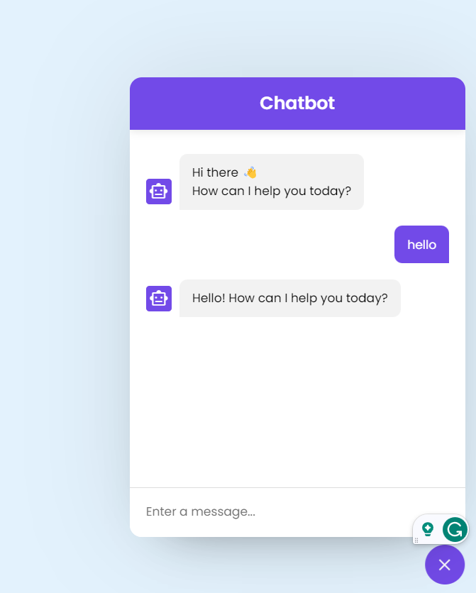

# Chatbot in JavaScript



This is a simple chatbot implemented in JavaScript using the OpenAI GPT-3.5 Turbo model. It provides a basic chat interface where users can interact with the chatbot.

## Features

- **Chat Interface**: The chatbot has a user-friendly interface that allows users to send and receive messages.

- **AI-Powered Responses**: The chatbot uses the OpenAI GPT-3.5 Turbo model to generate responses to user input.

- **Toggle Visibility**: Users can show or hide the chatbot interface by clicking the chatbot-toggler button.

## Prerequisites

Before running this chatbot, ensure that you have the following:

- Node.js installed on your system.
- An OpenAI API key. Set this key in the `.env` file as `OPEN_API_KEY`.

## Installation

1. Clone the repository:

   ```bash
   git clone https://github.com/yourusername/chatbot.git
   cd chatbot
Install dependencies:

bash
Copy code
npm install
Start the server:

bash
Copy code
node app.js
The chatbot will be accessible at http://localhost:3000 by default.